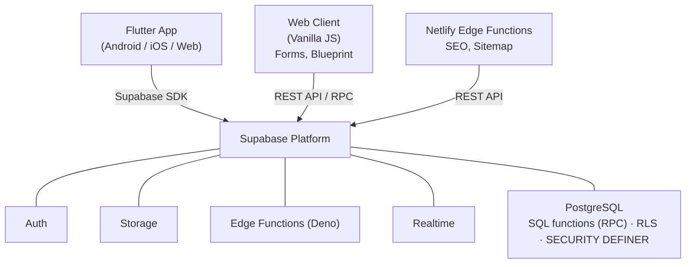

# Festapp

Festapp is a cross-platform mobile and web app for festivals, conferences, and
events. It provides organizers and attendees with powerful tools like schedules,
maps, notifications, tickets, forms, and much more.

Festapp powers [**vstupenky.online**](https://vstupenky.online) — a full-featured
ticketing and eshop platform for event organizers to sell tickets, manage orders,
and handle payments.

- Try now on [live.festapp.net](https://live.festapp.net) or install to your
  phone [here](https://live.festapp.net/#/install).
- Visit us on website: [festapp.net](https://festapp.net)</br></br>
  

---

## Features

- Available on Android, iOS, and Web.
- Event is available for offline use (Android, iOS, Web/PWA).
- Dark and light modes are available.
- **Volunteer Management**: Dedicated staffing system for managing tasks,
  shifts, and assignments.

---

- Schedule
  - Timeline – Schedule overview by time and day.
  - Event detail – Includes: Time, Place (with link), Content, Subevents, Sign
    In/Sign Out button.
  - Timetable – View event entries on the axes of Time and Place.
  - My schedule – Attendee can add event entries to their own list.

<p align="center">
  
  
  
  
</p>

- Map
  - Map with current user location, places, and paths with custom icons and
    descriptions. It is also possible to set up an offline map (Android, iOS).

<p align="center">
  
  
  
</p>

- News/Notifications
  - Receive news and push notifications relevant to the event.
  - Push notifications are supported on all platforms – Android, iOS, and Web.

<p align="center">
  
  
</p>

- Info/Songbook/Game
  - Various information about the event, a Songbook with font-size
    increase/decrease, and a groups-based code-guessing game.

- Administration/Feature settings
  - Overview of all event data, map, groups, users, rights, and other settings.
  - Setup of multiple events.

- User/Companions/Workshops
  - User profile with personal data.
  - Ability to import users from a table.
  - Creation of events with limited capacity (workshops) and creation of
    companions.
  - QR code for workshop entry verification.

<p align="center">
  
  
  
  
</p>

- Ticket/Form/Seat reservation
  - Support for creation of custom forms (similar to Google Forms) with priced
    products.
  - Creation of custom tickets with custom graphics.
  - Creation of a seat reservation component.

<p align="center">
  
  
  
  
</p>

- Orders/Transactions
  - Order management, bank payment synchronization, automated sending, and
    creation of paid tickets.

- Email Templates
  - Customization of all email templates.

<p align="center">
  
  
  
</p>

- Ticket scanning
  - QR-code-based ticket verification.

---

## Architecture

This project is built using the [Flutter](https://github.com/flutter/flutter)
framework and the Dart programming language.

For the backend, it uses [Supabase](https://github.com/supabase/supabase), a
serverless platform. It includes:

- Deno functions written in TypeScript
- PostgreSQL scripts for database operations



**Key Architectural Highlights**:

- **Offline-First**: The app is designed to work fully offline (critical for
  festivals). It uses a robust caching strategy (`OfflineDataService`) and local
  databases.
- **SQL-Centric Logic**: A significant portion of business logic (orders, games,
  permissions) resides in **PostgreSQL Functions (RPC)** rather than Dart code.
- **Multi-Tenant**: Supports multiple organizations, units, and occasions with
  role-based access control managed by `RightsService`.
- **Dual Frontend**: The Flutter app serves mobile/web, while a standalone
  vanilla JS web client (`web_client/`) handles public-facing forms, blueprints,
  and ticket ordering.

> [!TIP] **For Developers & AI Agents**:\
> Please consult these architectural documents:
>
> - **[docs/architecture/ai_context.md](docs/architecture/ai_context.md)** -
>   Architecture overview, directory structure, and component patterns
> - **[docs/architecture/SERVICES.md](docs/architecture/SERVICES.md)** -
>   Critical data services (RightsService, OfflineDataService, SynchroService)
> - **[docs/architecture/database.md](docs/architecture/database.md)** -
>   Database structure, SQL functions, and security patterns
> - **[docs/backend/edge_functions.md](docs/backend/edge_functions.md)** -
>   Supabase Edge Functions reference
>
> Also see: **[CONTRIBUTING.md](CONTRIBUTING.md)** for testing, security
> checklist, and commit workflow.

---

## Configuration

The project uses a **centralized configuration system** driven by
`automation/project.conf`. This file is the single source of truth for:

- **Deployment**: Domain settings (`DOMAIN`, `CNAME`).
- **Application**: Supabase credentials (`SUPABASE_URL`, `ANON_KEY`),
  Organization ID, and integration links.
- **Theme**: Brand colors (`THEME_SEED_1`...`4`) which are automatically applied
  to both Flutter (`app_config.dart`) and Web Client (`theme_config.css`).
- **Fonts**: Font family configuration (`FONT_FAMILY_BASE`) and form scaling.
- **Version**: Application version (`VERSION`), propagating to `pubspec.yaml`,
  `package.json`, and the app.

### Applying Configuration

After editing `automation/project.conf`, apply changes by running:

```bash
./automation/apply_config.sh
```

This script automatically:

1. Updates all relevant configuration files.
2. Auto-detects and installs fonts from `automation/fonts/`.
3. Synchronizes version numbers.

---

## Setup

For a helpful step-by-step guide on creating your own app, see
[docs/setup/howto.md](docs/setup/howto.md).

---

## Currently in production

- [Absolventský Velehrad](https://app.absolventskyvelehrad.cz)
- [Člověk a Víra](https://clovekavira.netlify.app)
- [BISCUP](https://biscup.netlify.app)
- [Celostátní setkání animátorů 2024](https://aksmcz.netlify.app)
- [Festival Slunovrat](https://app.festivalslunovrat.cz)
- [Hvězda mořská](https://hvezdamorska.netlify.app)
- [Jubileum mládeže 2025](https://jubileum2025.netlify.app)

Under similar names usually available in AppStore and Google Play Store.

---

## Latest Development

See **[CHANGELOG.md](CHANGELOG.md)** for the full development history.

Follow updates on the [Festapp WhatsApp Channel](https://whatsapp.com/channel/0029Vb64lj91CYoUWARKf80R) (in Czech).

---

## Testing

Run the full test suite with a single command:

```bash
./automation/test_all.sh
```

This runs: Web Client tests (JS), Database tests (SQL), Flutter tests, Edge
Function tests, and Integration tests. Database tests execute inside
transactions and auto-rollback, so no data is modified.

For more details on testing, deployment, and the security audit checklist, see
**[CONTRIBUTING.md](CONTRIBUTING.md)**.

---

## Development

### Prerequisites

- **FVM** (Flutter Version Management): `FLUTTER_VERSION` in
  `automation/project.conf` is the canonical SDK pin; `apply_config.sh`
  propagates it to FVM and editor configuration.
  - Install FVM: `dart pub global activate fvm`
  - Install project SDK: `fvm install`

### Running the Flutter App

Always prefix flutter/dart commands with `fvm`:

```bash
# Get dependencies
fvm flutter pub get

# Run on Chrome
fvm flutter run -d chrome

# Run code generation
fvm dart run build_runner build --delete-conflicting-outputs
```

### Running the Web Client

The standalone web client (forms, blueprints, ticket ordering) lives in `web_client/`:

```bash
cd web_client
npm install
npm run dev    # Development server
npm test       # Run tests
```

### Project Structure

```
festapp/
├── lib/                    # Flutter app (Dart)
│   ├── components/         # Feature modules
│   ├── data_services/      # Business logic & data access
│   ├── services/           # Helper services (time, toast, notifications)
│   └── database_tables/    # Table name constants (Tb class)
├── database/               # PostgreSQL logic
│   ├── functions/          # SQL functions (organized by domain)
│   ├── migrations/         # Schema migrations
│   ├── policies/           # Row Level Security policies
│   ├── tables/             # Table definitions
│   ├── tests/              # SQL regression tests
│   └── seed/               # Initial data
├── supabase/functions/     # Deno Edge Functions (TypeScript)
├── web_client/             # Standalone JS web client
│   ├── src/components/     # UI components (forms, blueprint, ticket ordering)
│   ├── src/services/       # Client services (auth, router, supabase, theme, localization, etc.)
│   ├── scripts/            # Build & test utilities
│   └── tests/              # Unit and integration tests
├── automation/             # Config, build, deploy scripts
│   ├── project.conf        # Single source of truth for configuration
│   └── apply_config.sh     # Propagates config to all targets
└── netlify/                # Edge functions (SEO, sitemap)
```

For detailed project architecture and internal documentation, please refer to
**[docs/architecture/ai_context.md](docs/architecture/ai_context.md)**.

---

## About

The app was originally developed by a team of volunteers for
[Absolventský Velehrad](https://absolventskyvelehrad.cz) event in 2023.
