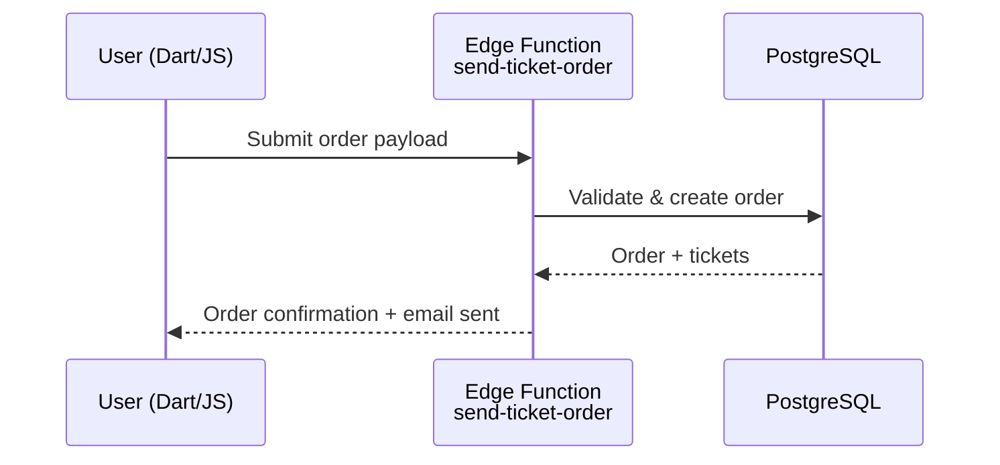
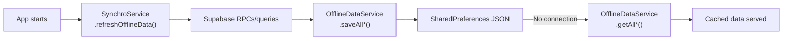

# Critical Data Services

> **Deep-dive into internal services** in `lib/data_services/`. Essential
> reading for understanding permissions, offline sync, and multi-tenancy.

This document complements **[ai_context.md](ai_context.md)** with implementation
details on critical services.

---

## RightsService

**Location**: `lib/data_services/rights_service.dart`

**Role**: Central singleton for permissions and multi-tenant context management.

### Key Responsibilities

1. **Context Management**:
   - Determines "Current Occasion" (`occasionLinkModel`)
   - Determines "Current Unit" (`currentUnit()`)
   - Manages navigation context

2. **Permissions**:
   - User rights checking (`isAdmin()`, `canEditOccasion()`, `canUpdateOrders()`, etc.)
   - RBAC (Role-Based Access Control)
   - Integration with PostgreSQL RLS

3. **State Management**:

   ```dart
   static OccasionLinkModel? occasionLinkModel  // Current occasion context
   static UnitModel? currentUnit()               // Current unit context
   static UserInfoModel? currentUser()           // Logged-in user
   ```

### Lifecycle

- Initialized at app startup (`main.dart`)
- Reset on logout or context change (occasion/unit switch)
- Interacts with `RouterService` for URL-based context

### Usage Patterns

```dart
// Check permissions (uses current occasion context automatically)
if (RightsService.isAdmin()) { ... }
if (RightsService.canEditOccasion()) { ... }

// Get current context
final unit = RightsService.currentUnit();
final occasion = RightsService.occasionLinkModel;
final user = RightsService.currentUser();
```

**CRITICAL**: Always check `currentUnit()` and `occasionLinkModel` before
displaying data - critical for multi-tenancy security!

---

## OfflineDataService

**Location**: `lib/data_services/offline_data_service.dart`

**Role**: Offline cache and local storage management.

### Key Features

- Local storage via SharedPreferences (JSON)
- Type-safe generic methods: `saveOffline<T>()`, `getOffline<T>()`, `getAllOffline<T>()`
- Domain-specific helpers: `saveAllEvents()`/`getAllEvents()`, `saveAllInfo()`/`getAllInfo()`, etc.

### Pattern

No automatic fallback. Code manually fetches remote, saves to cache, and reads from cache when offline:

```dart
// Save remote data to cache
await OfflineDataService.saveAllEvents(events);

// Read from cache when offline
final cached = await OfflineDataService.getAllEvents();
```

---

## SynchroService

**Location**: `lib/data_services/synchro_service.dart`

**Role**: Fetches remote data and populates offline cache. Read-only sync (no outgoing change queue).

### Key Methods

- `refreshOfflineData()` — Fetches user info, events, activities, inventory, places, path groups, icons, info, and news from Supabase and saves to OfflineDataService cache
- `getAppConfig(LinkModel)` — Retrieves app configuration via RPC (`get_app_config_v217`)

### Data Flow

```
SynchroService.refreshOfflineData() → Supabase RPCs/queries → OfflineDataService.saveAll*()
```

---

## Key Data Flows

**Order Creation Flow**:



**Offline Cache Flow**:



**For complete implementation details**, refer to:

- **Data Services**: `lib/data_services/` source code
- **SQL Functions**: `database/functions/user_permissions/`
- **RLS Policies**: `database/policies/`

---

**Last updated**: 2026-02-14
