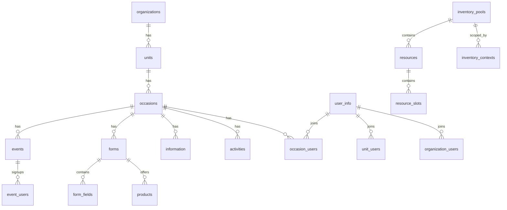

# Database Documentation

This directory contains the source code for the PostgreSQL database schema,
logic, and security policies.

## Structure

- **`functions/`**: Programmable logic (Stored Procedures/RPCs). This is where
  the core backend business logic resides (e.g., Order creation, User
  management).
  - **Naming Convention**: `verb_noun` (e.g., `scan_ticket`, `calculate_price`).
  - **Security**: Most functions use `SECURITY DEFINER` to run with owner
    privileges, bypassing RLS for complex multi-table operations.
- **`policies/`**: Row Level Security (RLS) policies defining who can see/edit
  what data.
- **`seed/`**: Initial data for setting up a fresh environment.
- **`tests/`**: SQL regression tests.
- **`tables/`**: Table definitions (though often managed via migrations).

## Architecture Patterns

### Split Brain Logic

A significant portion of the application's business logic resides here in SQL,
not in the client (Flutter/Web).

- **Write Operations**: Complex writes (like creating an order) are atomic SQL
  functions.
- **Read Operations**: Often use specialized views or RPCs to return "Frontend
  Ready" JSON.

## Testing

Database logic is tested using a dedicated runner that executes SQL test files
in a transaction and rolls them back.

Run tests via the root automation script:

```bash
./automation/test_all.sh
```

Or specific DB tests:

```bash
node web_client/scripts/run_db_tests.js database/tests/my_test.sql
```

See **[CONTRIBUTING.md](../../CONTRIBUTING.md)** for detailed testing patterns.

---

## Function Inventory

SQL functions organized by domain:

| Directory | Purpose | Key Functions |
|-----------|---------|---------------|
| `activities/` | Volunteer shift management | Task CRUD, assignment logic |
| `cron/` | Scheduled jobs | Automated cleanup, notifications |
| `emails/` | Email operations | Template rendering, logging |
| `eshop/` | Product management | `update_product`, product queries |
| `eshop_bank_accounts/` | Payment pairing | Bank account sync, matching |
| `eshop_forms/` | Form-order bridge | `create_form`, `get_form_by_link`, form CRUD |
| `eshop_orders/` | Order lifecycle | `scan_ticket`, `get_orders`, status transitions |
| `eshop_transactions/` | Transactions | `add_transaction_to_payment_info_ws` |
| `events/` | Schedule events | Event CRUD, sign-up logic, event feedback |
| `inventory/` | Capacity pools | Pool allocation, availability checks |
| `organization/` | Domain ops | Org settings, admin management |
| `others/` | Cross-cutting | `duplicate_occasion`, `check_is_*` guards, image records, email templates |
| `seed/` | Data seeding | Initial data setup |
| `support/` | Help operations | Support requests |
| `synchronization/` | Data sync | Sync state management |
| `units/` | Unit management | Unit CRUD, user-unit linking |
| `user_permissions/` | RBAC | `get_is_*` permission checks (boolean returns) |
| `user_services/` | Service assignments | User-service linking |
| `users/` | User management | `create_user_in_organization_with_data_pure`, `delete_user`, `import_user_group_assignments` |
| `utilities/` | Shared utilities | Helper functions |
| `utils/` | Additional utils | Format helpers |

---

## Security Audit Summary

### SECURITY DEFINER

- Many functions use `SECURITY DEFINER`, which bypasses Row Level Security and
  runs with owner privileges
- All must follow the mandatory checklist in
  **[CONTRIBUTING.md](../../CONTRIBUTING.md)**

### Permission Check Patterns

The codebase uses two permission function families:

1. **`check_is_*`** - Raises exception on failure (for write operations)
   - `check_is_editor_order_on_occasion(oc_id)` - Verifies order editor
   - `check_is_editor_order_view_on_occasion(oc_id)` - Verifies order viewer
   - `check_is_editor_on_unit(unit_id)` - Verifies unit editor
   - `check_is_manager_on_unit(unit_id)` - Verifies unit manager
   - `check_is_admin_for_bank_account(account_id)` - Verifies bank admin
   - `check_is_admin_of_organization(org_id)` - Verifies org admin

2. **`get_is_*`** - Returns boolean (for conditional logic)
   - `get_is_admin_on_occasion(oc_id)` - Returns true/false
   - `get_is_manager_on_occasion(oc_id)` - Returns true/false
   - `get_exists_on_occasion_user(user_id, oc_id)` - User exists check

### Search Path Discipline

Functions consistently use:
```sql
SET search_path = public, extensions
-- eshop_bank_accounts/ and eshop_transactions/ add the eshop schema:
SET search_path = public, eshop, extensions
-- some eshop/ functions that query eshop tables directly:
SET search_path = eshop, public, extensions
```

---

## Schema Overview

Key tables (defined in `lib/database_tables/tb.dart`):



### Core Hierarchy

| Table | Purpose | Key Columns |
|-------|---------|-------------|
| `organizations` | Domain-level container | `id`, `data` (JSONB config) |
| `units` | Real-world organizations | `id`, `organization` |
| `occasions` | Event instances | `id`, `unit`, `link`, `features` (JSONB) |

### User System

| Table | Purpose | Key Columns |
|-------|---------|-------------|
| `user_info` | User profiles | `id`, `email_readonly`, `organization` |
| `occasion_users` | User-occasion link | `user`, `occasion`, `is_editor_view` |
| `unit_users` | User-unit link | `user`, `unit` |
| `organization_users` | User-org link | `user`, `organization` |
| `user_companions` | Companion relationships | `user`, `companion` |
| `user_groups` | Group membership | `user`, `group` |
| `user_group_info` | Group metadata | `id`, `occasion`, `title` |
| `user_reset_token` | Password reset | `user`, `token` |

### Content

| Table | Purpose | Key Columns |
|-------|---------|-------------|
| `events` | Schedule entries | `id`, `occasion`, time fields |
| `event_users` | Event sign-ups | `user`, `event` |
| `event_users_saved` | My schedule items | `user`, `event` |
| `event_feedback` | Per-event rating/comment owned by a user or anonymous client ID | `event`, `occasion`, `user`, `client_id`, `rating` |
| `information` | CMS pages | `id`, `occasion` |
| `news` | Announcements | `id`, `occasion`, `created_by` |
| `places` | Map locations | `id`, `occasion` |
| `path_groups` | Map path groups | `id`, `occasion` |
| `icons` | Custom map icons | `id` |

### Forms

| Table | Purpose | Key Columns |
|-------|---------|-------------|
| `forms` | Form definitions | `id`, `occasion` |
| `form_fields` | Form field definitions | `id`, `form` |
| `products` | Purchasable items | `id` |
| `email_templates` | Email templates | `id`, `occasion` |
| `images` | Image records | `id` |

### Inventory & Activities

| Table | Purpose | Key Columns |
|-------|---------|-------------|
| `inventory_pools` | Capacity pools | `id` |
| `resources` | Inventory resources | `id` |
| `resource_slots` | Time-based slots | `id` |
| `inventory_contexts` | Pool contexts | `id` |
| `activities` | Volunteer tasks | `id`, `occasion` |
| `activity_assignments` | Task assignments | `id`, `activity_id` |

---

## RPC Call Map

Key SQL functions called from client code (search for `supabase.rpc(...)` in
Dart or `supabase.rpc(...)` in JS):

| RPC Function | Called From | Purpose |
|-------------|-------------|---------|
| `send-ticket-order` (Edge Function) | Web Client, Flutter | Receipted order create/replace + transactional effect queue |
| `replace_blueprint_order_client_sync_v1` | Edge Function | Atomic seat replacement and new order |
| `scan_ticket` | Flutter | Ticket verification |
| `delete_user` | Flutter | User deletion |
| `create_user_in_organization_with_data_pure` | SQL Functions (internal) | User creation |
| `get_ticket_details_for_generating` | Edge Functions | Ticket PDF data |
| `get_occasion_seo_data` | Netlify Edge | SEO metadata |
| `get_available_occasions` | Netlify Edge | Sitemap data |
