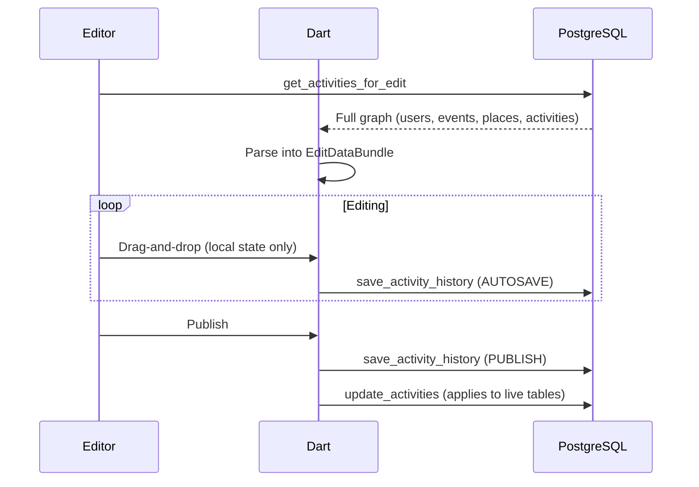

# Activities Component (Volunteer Management)

Not the public Schedule (attendee events) -- this is admin-side volunteer/staff task scheduling.

## Draft & Publish Pattern

Activities use version history, NOT simple CRUD.

- **Autosave**: Editor periodically calls `save_activity_history` RPC (type `AUTOSAVE`). Stored in history only -- does NOT affect live data.
- **Publish**: `save_activity_history` (type `PUBLISH`) + `update_activities` RPC overwrites live tables. Changes are invisible until publish.

If changes "aren't showing up", the admin probably hasn't published.

## Data Flow

## SQL RPCs

- `get_activities_for_edit` -- full activity graph for editor
- `save_activity_history` -- versioned JSON snapshot (AUTOSAVE or PUBLISH)
- `update_activities` -- applies snapshot to live tables
