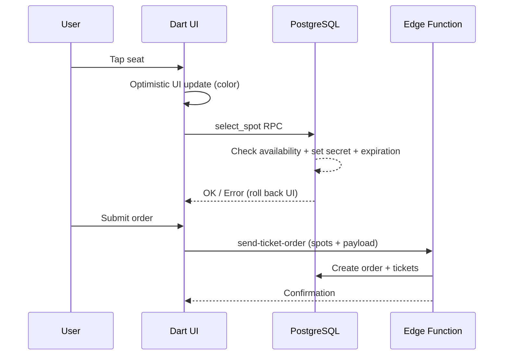

# Blueprint (Visual Seat Selection)

Visual seat selection/reservation interface for the Eshop.

## Split Brain: Dart UI vs SQL Authority (CRITICAL)

Selection state is managed optimistically in Dart but authoritatively in SQL.

- Dart updates UI color immediately on tap.
- `select_spot` RPC does the real work:
  1. Validates Blueprint/Form exists
  2. Checks availability (`order_product_ticket IS NULL`)
  3. On select: sets `secret` + `secret_expiration_time` (temporary lock)
  4. On deselect: verifies secret matches before clearing

**If RPC fails (spot taken by another user), UI must roll back** -- handled in `_handleSeatTap`.

## Gotchas

- **SVG Coordinates**: Do not change `BlueprintModel` parsing without verifying the SVG export format. Coordinate mapping is fragile.
- **Spot -> Product linking**: `BlueprintModel.findObject` locates objects by ID; complex logic links seat coordinates to Product IDs.

## Data Flow

## SQL RPCs

- `select_spot` -- locks/unlocks seat with secret and expiration
- `confirm_blueprint_order_change` -- atomic seat reassignment with storno of old tickets
