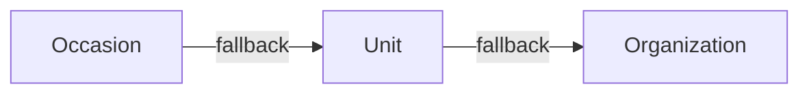

# Email Templates

## 3-Level Inheritance (CRITICAL)

Most specific wins. This applies to both template content AND banners/wrappers.

## Split Brain: Content vs Design

- **Content** (subject, body): `email_templates` table
- **Design** (banner, layout): `email_wrappers` table with `{{content}}` placeholder

Banner upload auto-regenerates wrapper HTML via `update_entity_email_banner` RPC.

## Sending Emails

Delivery handled by `send-custom-email` Edge Function, NOT Dart. Debug delivery issues there.

`get_email_template_and_wrapper` resolves both template and wrapper at send time. Payload uses `{{var}}` style substitution.

## SQL RPCs

- `get_entity_email_templates` -- fetches templates with inheritance resolution
- `update_email_template` -- persists single template changes
- `update_entity_email_banner` -- updates banner + regenerates wrapper HTML
- `get_email_template_and_wrapper` -- resolves template + wrapper for sending
