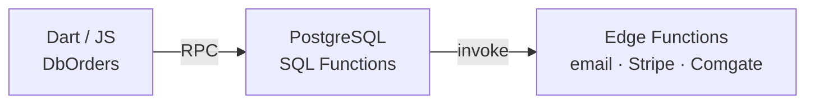

# Eshop (Orders, Tickets, Payments)

## Split Brain: Dart Reads, SQL Writes (CRITICAL)

Dart is a thin RPC wrapper. ALL write logic lives in SQL. Do NOT replicate multi-step logic in Dart -- causes race conditions.

## Atomic Order Changes (`confirm_blueprint_order_change`)

This SQL function handles the Old Order -> New Order atomic switch:
1. `analyze_new_order_spots` checks if spots are occupied
2. If occupied, cancels old tickets (`storno_tickets_bulk`)
3. Clears secrets, prepares new order JSON
4. Dart takes output and sends to `send-ticket-order` Edge Function

**Warning**: If modifying the "Claim" button, check this SQL path.

## Gotchas

- **Stringly Typed**: `OrderModel` fields mapped from `Tb` class strings. Renames break silently.
- **3-Layer Architecture**:

- **Storno RPC**: `update_order_and_tickets_to_storno_ws_221` -- the `_ws_221` suffix is not a typo

## SQL RPCs

- `select_spot` -- temporary spot lock with secret + expiration
- `confirm_blueprint_order_change` -- atomic seat reassignment with storno
- `update_order_and_tickets_to_paid_ws` -- marks order + tickets paid
- `update_order_and_tickets_to_storno_ws_221` -- cancels order + tickets
- `scan_ticket` -- validates + processes ticket scanning (enforces entrance limits)
- `get_report_ws` -- financial report for an occasion
