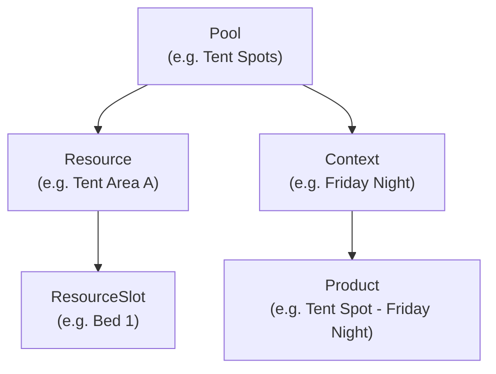

# Inventory (Capacity & Stock Management)

## Concept Hierarchy (Non-Obvious)

Products link to **Contexts**, NOT directly to Pools.

This indirection allows one pool to serve multiple products/time-slots.

## Bundle Pattern

Entire inventory state fetched AND saved in one SQL call. Do NOT add separate Dart fetches -- extend `get_inventory_pool_bundle` SQL instead.

Save is also atomic: `update_inventory_pool_bundle` receives the entire bundle as JSON.

## SQL RPCs

- `get_inventory_pool_bundle` -- complete pool with resources, slots, contexts, products
- `get_inventory_pools_by_occasion_link` -- lists all pools for an occasion
- `update_inventory_pool_bundle` -- saves entire pool bundle in one transaction
- `get_spot_management_bundle` -- spots with related data for admin assignment
- `update_spot_assignments` -- batch-updates spot assignments
- `get_user_inventory` -- current user's accommodation/resource assignments
